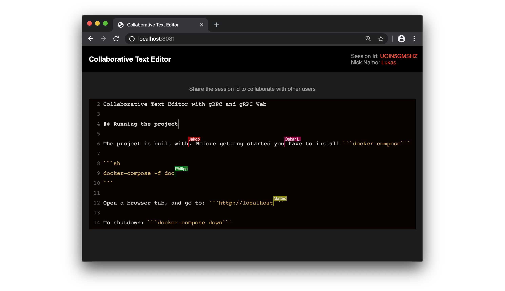

# Collaborative Realtime Texteditor [](https://travis-ci.com/mountainflo/collaborative-text-editor)

Collaborative realtime texteditor with gRPC using RGAs (Replicated Growable Arrays).



With the collaborative realtime texteditor several users can edit documents together in realtime.
Via Remote-Cursors the current editing positions of the other users are always visible.

The implementation of the collaborative realtime editor is using a variant of RGAs (Replicated Growable Arrays).
The RGA-protocol is implemented as Timestamped Insertion Tree (TI Tree) and guarantees "Eventual Consistency".

For more details about the implementation see: [documentation.md](documentation/documentation.md)

## Running the project

The project is built with docker-compose. Before getting started you have to install ```docker-compose```.

You can start the ```production```-configuration with the following docker-compose command:

```sh
docker-compose -f docker-compose.yml -f docker-compose.prod.yml up --build
```

Open a browser tab, and go to: ```http://localhost:8081/index.html```

To shutdown the containers: ```docker-compose down```


## Local development

### Remote debugging and hot reloads

The ```dev```-configuration uses hot-reloads (for js and scss files) and offers remote debugging for go files via `delve`.

Create a "Go Remote Debugging"-Configuration in your IDE and listen to port `40000`.


Start the ```dev```-configuration with:

```sh
docker-compose -f docker-compose.yml -f docker-compose.dev.yml up --build
```


### Compiling proto files for go

```sh
go get -u google.golang.org/grpc
go get -u github.com/golang/protobuf/protoc-gen-go

protoc -I collabTexteditorService/ collabTexteditorService/collabTexteditorService.proto --go_out=plugins=grpc:collabTexteditorService
```

### Compiling proto files for js

```sh
protoc -I collabTexteditorService collabTexteditorService/collabTexteditorService.proto \
--js_out=import_style=commonjs:./frontend/src \
--grpc-web_out=import_style=commonjs,mode=grpcwebtext:./frontend/src
```

### Debugging with docker

To open the console of a specific container run:

```sh
docker exec -it collaborative-text-editor_frontend-client_1 /bin/bash
```

The following command gives you a list of status of all containers:

```sh
docker-compose ps
```

### Bundling and building js-Frontend

```sh
npm install
npm run build
```
